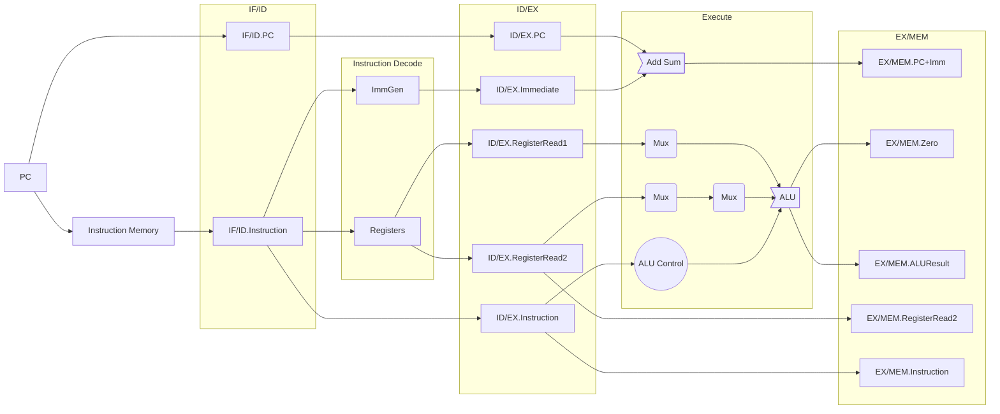

```mermaid
graph LR
  PC --> im[Instruction Memory]
  PC ---> IF/ID.PC
  im --> IF/ID.Instruction
  IF/ID.Instruction --> Registers
  IF/ID.Instruction --> ImmGen
  IF/ID.Instruction --> ID/EX.Instruction
  Registers --> ID/EX.RegisterRead1
  Registers --> ID/EX.RegisterRead2
  ImmGen --> ID/EX.Immediate

  IF/ID.PC --> ID/EX.PC
  ID/EX.PC --> sum
  ID/EX.Immediate --> sum

  ID/EX.RegisterRead1 --> fwdA
  ID/EX.RegisterRead2 --> fwdB

  fwdA --> alu
  fwdB --> origAlu
  origAlu --> alu

  ID/EX.Instruction --> aluControl
  aluControl --> alu

  sum --> EX/MEM.PC+Imm
  alu --> EX/MEM.Zero
  alu --> EX/MEM.ALUResult
  ID/EX.RegisterRead2 --> EX/MEM.RegisterRead2
  ID/EX.Instruction --> EX/MEM.Instruction

  subgraph IF/ID
    IF/ID.Instruction
    IF/ID.PC
  end

  subgraph Instruction Decode
    Registers
    ImmGen
  end

  subgraph ID/EX
    ID/EX.PC
    ID/EX.RegisterRead1
    ID/EX.RegisterRead2
    ID/EX.Immediate
    ID/EX.Instruction
  end

  subgraph Execute
    sum>Add Sum]
    alu>ALU]
    aluControl((ALU Control))
    fwdA(Mux)
    fwdB(Mux)
    origAlu(Mux)
  end

  subgraph EX/MEM
    EX/MEM.PC+Imm
    EX/MEM.Zero
    EX/MEM.ALUResult
    EX/MEM.RegisterRead2
    EX/MEM.Instruction
  end
```
